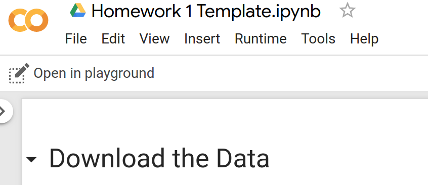
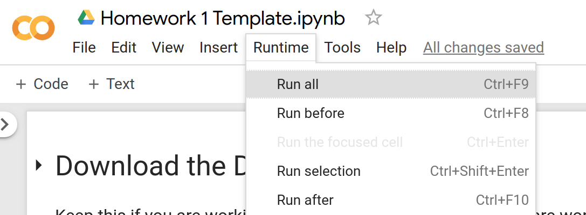
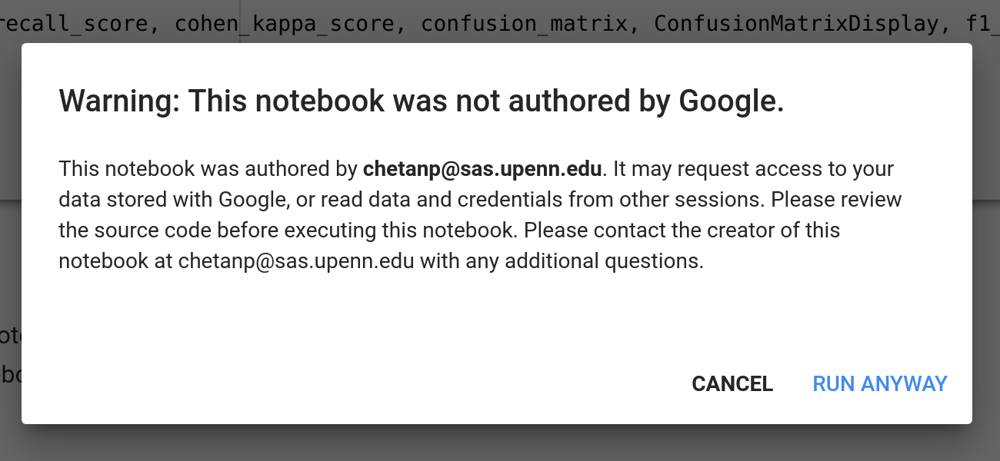

# MSSP 608 on GitHub
This GitHub respository contains all of the Google Colab materials from the first run of MSSP 608 - Practical Machine Learning. The Google Colab links to all the notebooks will be updated here and the Lecture/Homework notebook sources will be uploaded here in folders.

# Lecture Notebooks on Google Colab
- [Day 1 [Exploratory Data Analysis, Decision Trees, Information Theory, and Intro to Machine Learning]](https://colab.research.google.com/drive/1FBT6ZPy8ykSGmm86j4m2pUIgstP7ZNUK)
- [Day 2 [Test Sets, Metrics, and Logistic Regression]](https://colab.research.google.com/drive/174sQY421wwoj4dtMdURSMH7udP3zZn3a)
- [Day 3 [Cross Validation and Hyperparameters]](https://colab.research.google.com/drive/1yExnaqLyjKswI_3xw98xF0GeDAegkl48)
- [Day 4 [Text Data and Naive Bayes]](https://colab.research.google.com/drive/1FYRjq09Z9Cx_mHVueVX9j3myTyRE-s05#scrollTo=s1aBRInnp5k3)
- [Day 5 [Dependency Parsing, Multilingual NLP. Domain Transfer, and Word Embeddings]](https://colab.research.google.com/drive/1mBWDteLZvL-dQO6S2LI6HtVLzZ3cy2Iv)
- [Day 6 [k-Nearest-Neighbors and Support Vector Machines]](https://colab.research.google.com/drive/1TLLWELc6iS12w0GcF_KCIBpPDcIU53fA)
- [Day 7 [Ensemble Methods and Unsupervised Learning]](https://colab.research.google.com/drive/1in9ZZ7Huc_TjJfUQw8BHy8qVgVO8Z44y)
- [Day 9 [Neural Networks and Deep Learning]](https://colab.research.google.com/drive/1M_LDlCQWbzzC7tzdFHol9ta2U01b2ojo#scrollTo=E1RN2m6JXU0h)

# Homework Notebook Templates on Google Colab
- [Homework 1 Template](https://colab.research.google.com/drive/1r9KIhVWqroSNJZf2rf0LizIO1n2d9iVt)
- [Homework 2 Template](https://colab.research.google.com/drive/1JUY5zVghRRFgE9crreTJrDHTIC6i0OMr)
- [Homework 5 Template](https://colab.research.google.com/drive/1QIIVuJxlhvk0A-5yygvDpv-YHiYRfzrv)

# Recitation Slides
- [Recitation #2 - Python Libraries, Hyperparameter Optimization, Bias/Variance](Recitation2-MSSP608.pdf)
- [Recitation #3 - SVMs, Naive Bayes, kNNs, and tricks in Google Colab](Recitation3-MSSP608.pdf)
# Using the Colab Notebooks
First open the link to whatever notebook you want to run (you must also be signed into a Google Account). Then follow the link that says "Open in Playgroud"

After this, simply navigate to the run tab and click "run all" now you have a fully run, completely editable jupyter notebook running in the cloud! Yay!

If you get a warning, just hit "Run Anyways".

For more info on Google Colab, check out [this tutorial from Google](https://colab.research.google.com/notebooks/intro.ipynb)
